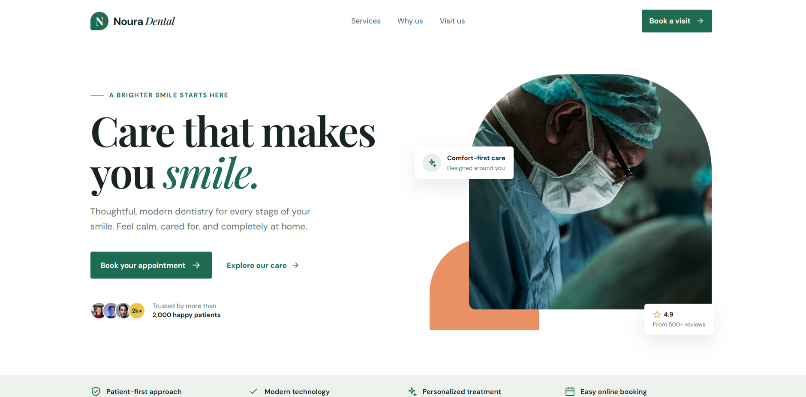

# Noura Dental Landing Page

A polished responsive dental clinic landing page built with React.

## Overview
This project is a modern, single-page web application designed for a dental clinic. It provides a clean and professional user interface to showcase services, build trust with potential patients, and facilitate appointment bookings.

## Key Features
The landing page includes the following sections and components:
- **Header**: Navigation and branding.
- **Hero Section**: An engaging introductory section.
- **Trust Strip**: A section designed to build credibility (e.g., patient statistics, ratings).
- **Services**: A detailed list of dental services offered.
- **About**: Information about the clinic and its team.
- **Booking Form**: A straightforward way for users to request appointments.
- **Footer**: Important links, contact information, and operating hours.

## Tech Stack
This project is built using:
- **[React](https://react.dev/)**: For building the user interface with functional components.
- **[Vite](https://vitejs.dev/)**: As the fast frontend build tool.
- **Vanilla CSS**: For styling and layout (no external CSS frameworks were used).

## Project Structure
```text
noura-dental-landing/
├── index.html            # Main HTML entry point
├── package.json          # Project metadata and dependencies
├── src/                  # Source code directory
│   ├── App.jsx           # Main application component
│   ├── main.jsx          # React DOM rendering entry point
│   ├── components/       # Reusable React components
│   │   ├── About/
│   │   ├── Booking/
│   │   ├── Footer/
│   │   ├── Header/
│   │   ├── Hero/
│   │   ├── Icon/
│   │   ├── Services/
│   │   └── TrustStrip/
│   ├── data/             # Static data files
│   │   └── servicesData.js
│   └── styles/           # Global stylesheets
│       └── global.css
```

## Preview

### Homepage



## Getting Started

Follow these instructions to set up the project locally.

### Prerequisites
Make sure you have [Node.js](https://nodejs.org/) installed on your machine.

### Installation
1. Clone the repository (if applicable) or download the project files.
2. Open a terminal and navigate to the project directory:
   ```bash
   cd noura-dental-landing
   ```
3. Install the required dependencies:
   ```bash
   npm install
   ```

### Development Server
To start the local development server, run:
```bash
npm run dev
```
This will launch the application locally, typically at `http://localhost:5173/`.

### Production Build
To create an optimized production build, run:
```bash
npm run build
```
To locally preview the generated production build, run:
```bash
npm run preview
```

## Responsive Design
The application is designed to be responsive, utilizing standard viewport meta tags and custom CSS styling to ensure it displays correctly across different devices and screen sizes.

---
*Created as part of a professional developer portfolio.*
